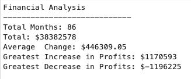

# Python Homework 1 | Automate Your Day Job with Python

### Welcome to Ichiban Ramen

## PyBank
Analyzed financial records from dataset: [budget_data.csv](Resources/budget_data.csv)
Printed to .txt file: [fin_analysis.txt](fin_analysis.txt)

## PyRamen
Analyze financial performance by cross-referencing sales data with internal menu data to figure out revenues and costs for the year. Additional data for how well the business did on a per-product basis to determine what products are doing well vs. poorly. 